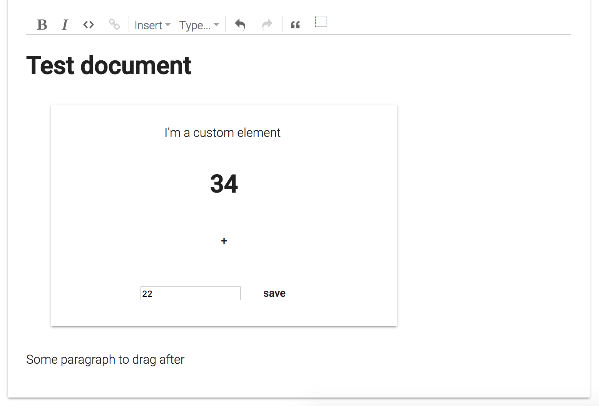

# About

It has often been a challenge to integrate Angular components into Marijn Haverbekes excellent ProseMirror editor library.
Since custom elements landed in Angular 6 this offered a great way to improve the developer workflow through web standards.

This project contains an example of how custom elements could be used inside of ProseMirror.
The custom element consists of a couple of controls and uses the Angular Material components to style its content.

Events are handed through web standards. To show how the integration with the rest of an app might work it contains a global service that can be updated from all component instances.

License is MIT.

# Angular 6 Elements meets the ProseMirror Editor

This project was generated with [Angular CLI](https://github.com/angular/angular-cli) version 6.0.0.

## Development server

Run `ng serve` for a dev server. Navigate to `http://localhost:4200/`. The app will automatically reload if you change any of the source files.

## Code scaffolding

Run `ng generate component component-name` to generate a new component. You can also use `ng generate directive|pipe|service|class|guard|interface|enum|module`.

## Build

Run `ng build` to build the project. The build artifacts will be stored in the `dist/` directory. Use the `--prod` flag for a production build.

## Running unit tests

Run `ng test` to execute the unit tests via [Karma](https://karma-runner.github.io).

## Running end-to-end tests

Run `ng e2e` to execute the end-to-end tests via [Protractor](http://www.protractortest.org/).

## Further help

To get more help on the Angular CLI use `ng help` or go check out the [Angular CLI README](https://github.com/angular/angular-cli/blob/master/README.md).
